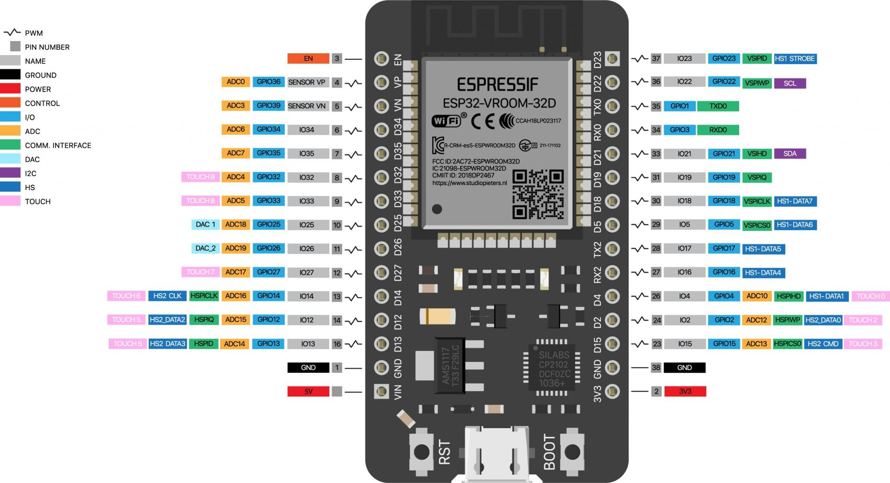
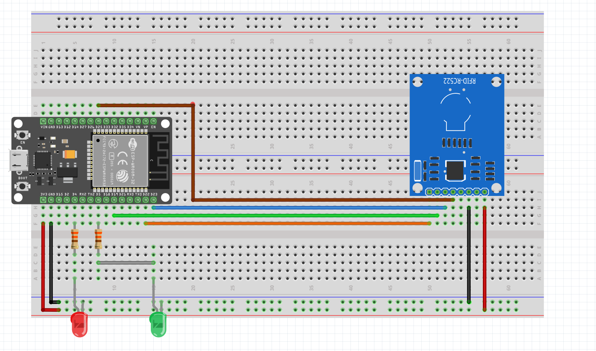

## Lector RFID con conexión mediante Wi-Fi y protocolo MQTT.

En este proyecto tenemos un lector de tarjetas RFID que publica las tarjetas leídas en un cierto tópico. Un servicio Backend recibe esa publicación, verifica que el código RFID pertenezca a un usuario autorizado y publica una respuesta.

[Documentación](https://calm-muffin-a00bc9.netlify.app/files.html)

## Estructura del proyecto


### Observaciones
- **Librerías en `include/`:** Aquí se encuentran los archivos de encabezado que contienen las definiciones de las funciones y estructuras utilizadas en el proyecto.

## Configuración

El archivo `config.h` define las siguientes configuraciones:

####  Pines GPIO

- **LED interno del ESP**: GPIO 2
- **Lector RFID RC522**:
  - MISO: GPIO 25
  - MOSI: GPIO 23
  - SCK: GPIO 19
  - SDA: GPIO 22

#### Configuración MQTT

- **URL del broker MQTT**: `mqtt://broker.hivemq.com`
- **Tópicos MQTT**:
  - `grupob_request`: Publicación de información de tarjetas RFID
  - `grupob_request1`: Suscripción a comandos de control

#### Configuración Wi-Fi
- **Credenciales Wi-Fi:** Almacena tu contraseña de Wi-Fi en `wifi_credentials.h` dentro de include.
```c
#ifndef _WIFICREDENTIALS_H
#define _WIFI_CREDENTIALS_H

#define WIFI_CREDENTIALS_ID    ("name")
#define WIFI_CREDENTIALS_PASS  ("password")

#endif
```
La placa utilizada para realizar las pruebas tiene la siguiente distribución de pines. Imagen extraída de la tienda donde se compro el modelo del ESP32


[Link a tienda](https://tienda.starware.com.ar/producto/placa-desarrollo-espressif-esp32-ch9102x-dual-core-wifi-bluetooth/)


### Imagen de conexiones




### Funcionamiento (demo primer prototipo).


### Diagrama de funcionamiento del dispositivo.


1. **ESP32 (Microcontrolador):** 

    - **Conexión con el servidor:** En este caso se conecta con el servidor de tipo broker MQTT llamado HiveMQ. El mismo se usa para suscripción y publicación a tópicos. 
    - **Publicación código de tarjeta RFID** cuando el usuario acerca una tarjeta o llavero RFID publica en el tópico `grupob_request` el código RFID del objeto escaneado.
    - **Estado autenticación** el sistema se suscribe al tópico `grupob_request1` si el backend autentico de manera exitosa al usuario, el tópico devuelve un 1 de lo contrario va a devolver un 0. El sistema procesa y extrae esta respuesta publicada en el tópico para controlar el estado de los GPIOs
  
2. **Backend (Servidor):** [Repositorio de API](https://github.com/facumruiz/rfidhub)
    - **Conexión con el servidor** El servidor establece una conexión con el ESP32 por medio del broker MQTT. Esto permite que ambos dispositivos se comuniquen entre sí.
    - **Extracción numero RFID** el sistema se suscribe al `grupob_request` en el cual se hace una publicación del numero RFID escaneado.  
    - **Publicación del estado de autenticación** se publica en el tópico `grupob_request1` el estado de autenticación.
  

Para más detalles sobre la configuración y uso, el archivo generado por Doxygen disponible en [enlace de la documentación](https://calm-muffin-a00bc9.netlify.app/files.html)


